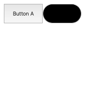

# Jest React Snapshot

<span></span>

[](https://app.dependabot.com)
[](https://github.com/iamogbz/jest-react-snapshot)
[](https://github.com/iamogbz/jest-react-snapshot/actions)
[](https://coveralls.io/github/iamogbz/jest-react-snapshot?branch=refs/heads/master)
[](https://www.npmjs.com/package/jest-react-snapshot)

> Snapshot react components as images in jest tests

## Usage

```typescript
import { imageToMatchSnapshot } from "jest-react-snapshot";

expect.extend({ imageToMatchSnapshot });

it("renders component matching snapshot", async (): Promise<void> => {
    await expect(<Component {...props} />).imageToMatchSnapshot();
});
```

See [repo test](./tests/index.test.tsx) for more details.



### Advanced Usage

Uses [`jest-image-snapshot`](https://github.com/americanexpress/jest-image-snapshot) to power the image snapshot and diffing functionality.

Supports the `toMatchImageSnapshot` [API](https://github.com/americanexpress/jest-image-snapshot#%EF%B8%8F-api), providing some default configuration.

```typescript
await expect(<Component {...props} />).imageToMatchSnapshot(customOptions);
```

### Test Environment Setup

Easiest way is to use [`jest-puppeeter`](https://github.com/smooth-code/jest-puppeteer) which provides sensible defaults for your testing environment.

#### Example Jest Config

```json
    "jest": {
        "preset": "jest-puppeteer",
        "moduleDirectories": [
            "./src",
            "./tests",
            "./node_modules"
        ],
        "transform": {
            "^.+\\.tsx?$": "ts-jest"
        },
        "testPathIgnorePatterns": [
            "./artifacts/",
            "./node_modules/"
        ]
    }
```

## Further Work

- Replace `puppeteer` with lighter renderer as only the `HTML` and `CSS` layout engine is used.
